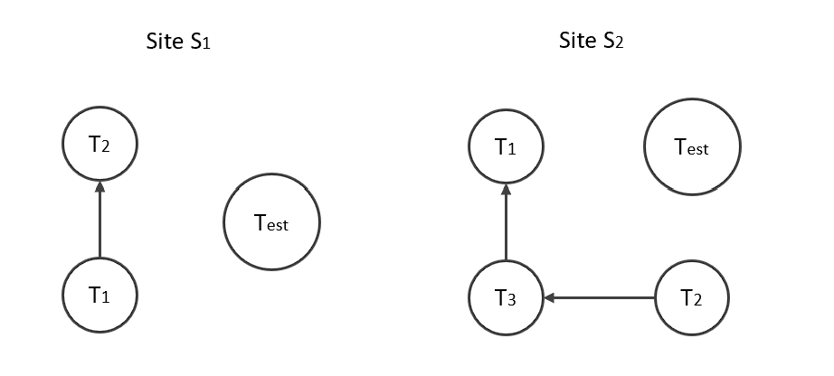
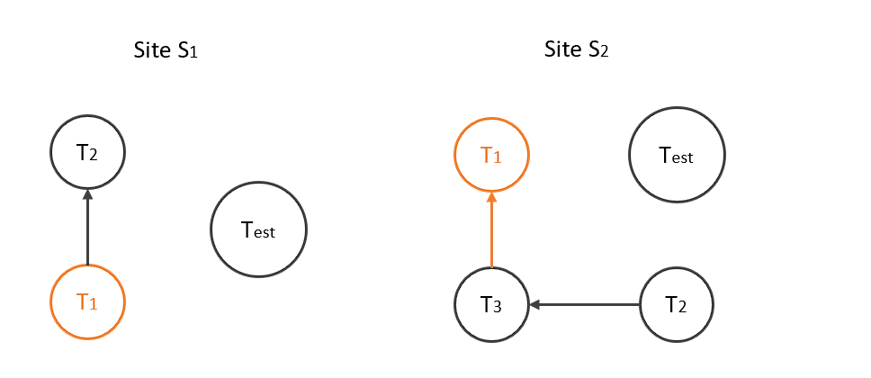
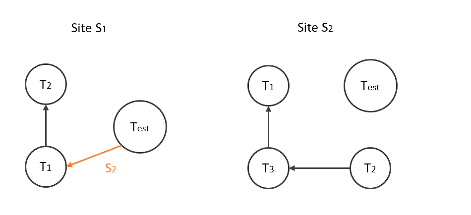
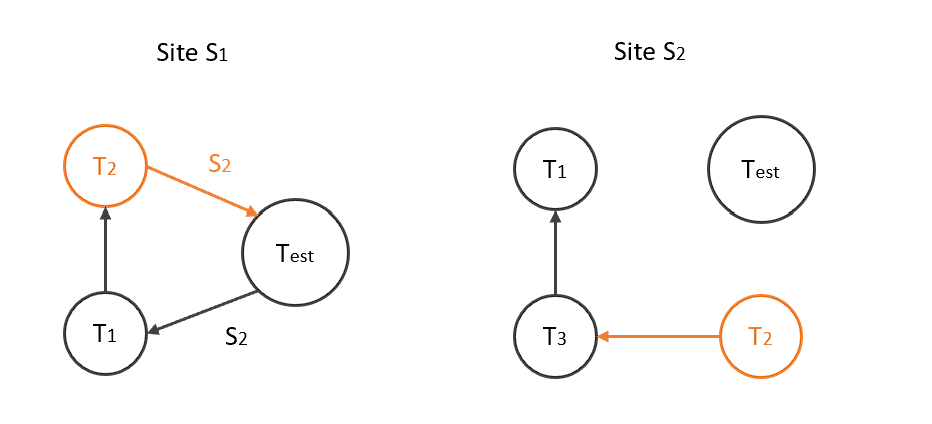
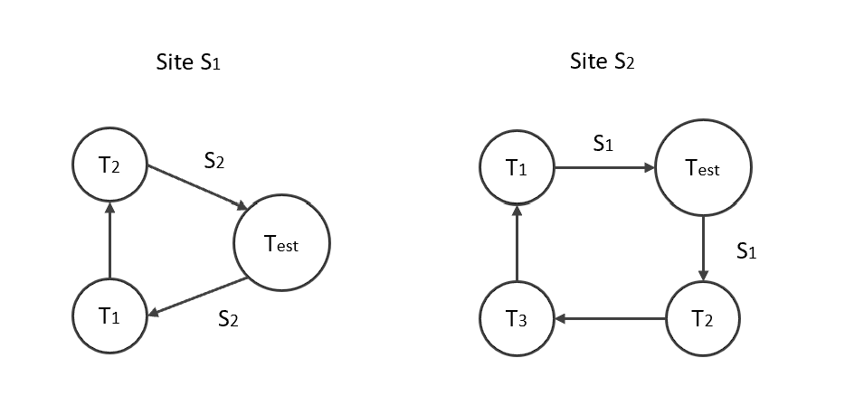
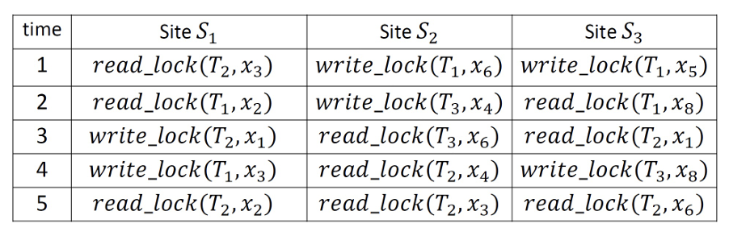
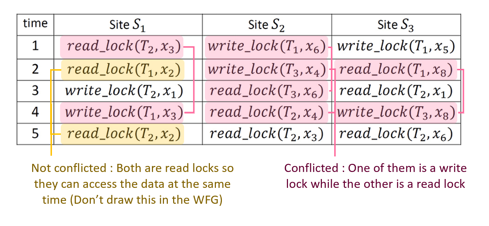
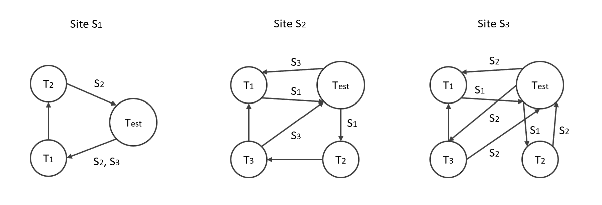
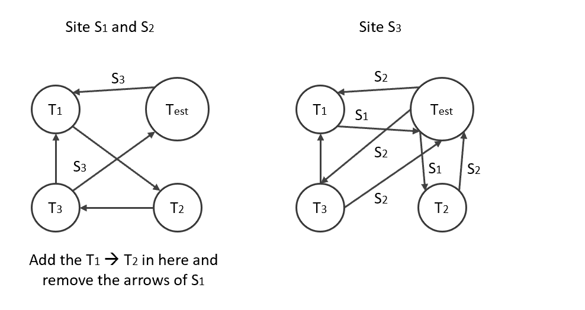
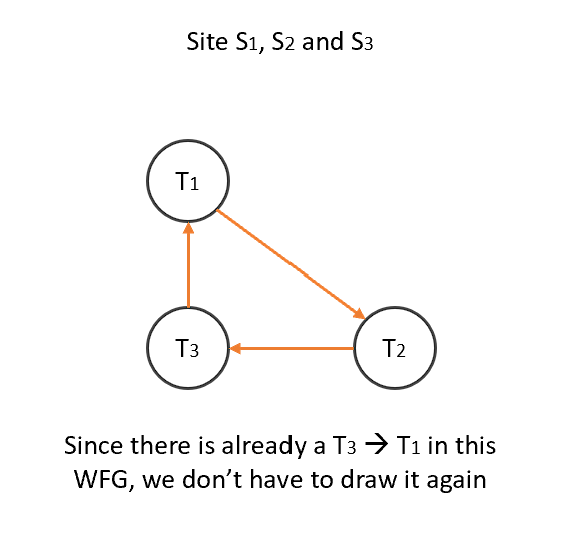

# Appendix for COMP2211 Exam Notes - Database

### XML Syntax and Examples
##### Basic Tags Structure 
```xml
<element-name>
    <subelement-name>Data</subelement-name>
</element-name>
```

Ordering matters : 
```xml
<element-name>
    <sub1>First</sub1>
    <sub2>Second</sub2>
</element-name>
<!--Not equals to -->
<element-name>
    <sub2>Second</sub2>
    <sub1>First</sub1>
</element-name>
```

Case also matters (for tags) :
```xml
<element-name>lower case tags</element-name>
<!--Not equals to -->
<ELEMENT-NAME>upper case tags</ELEMENT-NAME>
```
\
##### XML Attributes
Subelements can have the same attribute name with the element :
```xml
<student verified="yes" id="0001">
    <name verified="no">April</name>
</student>
```

Ordering doesn't matter :
```xml
<student id="0002" fd-idref="0001">
    <name>Bob</name>
</student>
<!--Equals To-->
<student fd-idref="0001" id="0002" >
    <name>Bob</name>
</student>
```

Some attributes can be represented as subelements :
```xml
<student>
    <verified>Yes</verified>
    <name>Cindy</name>
</student>
```
\
##### Well Formed XML
1. Has XML declaration
```xml
<?xml version="1.0" encoding="UTF-8" standalone="yes"?>
```

2. Has a single root
3. All tags are properly nested
```xml
<root>
    <tag></tag>
    <tag>
        <subtag></subtag>
    </tag>
</root>
```
\
##### DTD for XML
External DTD :
```xml
<!ELEMENT Root (Element*)>
<!ELEMENT Element (Sub1, (Sub2|Sub3)+, Sub4?)>
<!ELEMENT Sub1 (#PCDATA)> 
<!ELEMENT SUB2 (#CDATA)> 
    <!--<!ATTLIST element-name attribute-name type>-->
    <!ATTLIST SUB2 OneInTwo (Default1 | Option2) "Default1"
                   ParsedText PCDATA #REQUIRED
                   Optional PCDATA #IMPLIED>
<!ELEMENT Sub3 (#PCDATA)>
    <!ATTLIST Sub3 Sub3ID ID #REQUIRED>
<!ELEMENT Sub4 (#PCDATA)>
    <!ATTLIST Sub4 RefToSub3 IDREF>
```
| Symbols | Definitions |
| ------- | ----------- |
| \| | Or |
| ＊ | Zero or more |
| ＋ | One or more |
| ? | Zero or one |
| #PCDATA | Parsed text (e.g. ```amp``` = &) |
| #CDATA | Unparsed data |
| #REQUIRED | This attribute is required |
| #IMPLIED | This attribute is optional |
| ID | This attribute is an ID |
| IDREF | This attribute is a reference to an ID |
* All leaf tags (The ones without anymore sub-elements) should be specified ```(#CDATA)``` or ```(#PCDATA)```

To link an external DTD in a XML file :
```xml
<!DOCTYPE root SYSTEM "file.dtd">
```
Or to have an internal DTD :
```xml
<!DOCTYPE root [
    <!--Same as External DTD-->
]>
```
\
### XPath
The example XML :
```xml
<root>
    <student role="representative" id="0001">
        <name>April</name>
        <department>
            <code>G400</code>
            <course>Computer Science</course>
        </department>
    </student>
    <student id="0002" fd-idref="0001">
        <name>Bob</name>
        <department>Law</department>
    </student>
</root>
```

Matching elements : ```/root/studentname```
```xml
<name>April</name>
<name>Bob</name>
```

Skip intermediate paths : ```//code```
```xml
<code>G400</code>
```

Match all sub-elelements : ```/root/student/department/*```
```xml
<code>G400</code>
<course>Computer Science</course>
```

Match attributes : ```//student/@role``` (```@``` indicates an attribute)
```xml
'role = representative'
```

If conditions
*Equality* : ```//student[@id="0002"]```
```xml
<student id="0002" fd-idref="0001">
        <name>Bob</name>
</student>
```

*Existence* : ```//department[code]```
```xml
<department>
        <code>G400</code>
        <course>Computer Science</course>
</department>
```

*More than one conditions* : ```//department[code][course]```
```xml
<department>
        <code>G400</code>
        <course>Computer Science</course>
</department>
```

Specifying axes : ```//department[preceding-sibling::name="April"]```
```xml
<department>
        <code>G400</code>
        <course>Computer Science</course>
</department>
```


Functions
*Text only (No tags)* : ```//code/text()```
```xml
G400
```

*Tag name* : ```//code/name()``
```xml
code
```

*Positions* : ```//student[position()=2]``` or ```//student[2]```
```xml
<student id="0002" fd-idref="0001">
        <name>Bob</name>
        <department>Law</department>
</student>
```
* XPath's position starts at 1

/
### XQuery
##### Basic Composition
```xquery
FOR or LET $[variable] IN or := [XPath]
WHERE [condition]
RETURN {[output]}
```
Example :
```xquery
FOR $x IN doc("file.xml")/root/student
WHERE $x/@id = "0002"
RETURN {$x/department}
```
```xml
<department>Law</department>
```
FOR returns multiple variables :
```xml
<result><department>Computer Science</department></result>
<result><department>Law</department></result>
```
While LET returns a list of multiplel variables :
```xml
<result>
    <department>Computer Science</department>
    <department>Law</department>
</result>
```
* The ```<result>``` tag has to be added as ```RETURN <result> {$x} </result>```
\
##### Functions
```xquery distinct-values([XPath])``` : No duplication
```xquery text()``` : Text only
```xquery contains(variable, value)``` : Contains a string

Aggergate functions for LET :
```xquery
avg()
count()
min()
max()
sum()
```
\
##### Double Iterations
Get variables based on other variables :
```xquery
FOR $x IN doc("file.xml")//student
    $y IN doc("file.xml")//student[@idref=$x/@id]
RETURN <result> {$y/name/text()} </result>
```
```xml
<result>Bob</result>
```
Also works with multiple files :
```xquery
FOR $x IN doc("file.xml")//student
    $y IN doc("anotherfile.xml")//student
WHERE $x/@id = $y/@id
RETURN {$x, $y/score}
```
\
##### Nested Queries
```xquery
FOR $x IN doc("file.xml")//student
RETURN {
    FOR $y IN doc("file.xml")//student[@fd-idref=$x/@id]
}
```
```xml
id=0002
```
\
##### Order By
```xquery
FOR $x IN doc("file.xml")//department
ORDER BY $x
RETURN {$x}
```
```xml
<department>Computer Science</department>
<department>Law</department>
```
\
##### If Then Else
```xquery
For $x IN doc("file.xml")//student
RETURN {
    IF $x/@id == 0001
        THEN $x/department/code
    ELSE $x/department/course
}
```
```xml
<code>G400</code>
<department>Law</department>
```
\
##### Quantifiers
Return ```$x``` if one ```$y``` matches :
```xquery
WHERE SOME $y IN $x SATISFIES [condition] 
```
Return ```$x``` if all ```$y``` match :
```xquery
WHERE Every $y IN $x SATISFIES [condition] 
```
\
### Distributed Deadlocks
##### Steps
1. Find pairs of conflicted Ts in the same site, where at least one of them is writing on the same data
2. Draw the local WFGs with T_est
3. Combine the local WFGs one by one
4. If there is a cycle in the final (i.e. global WFG) = Deadlock
\
##### Deciding the arrows from/to T_est
\* Example taken from 2023PP
Site S1 and S2's local WFGs orginally look like this

Now look at the T1 from S1, check the T1 in the other site, we can see that T1 is waited by some transactions (doesn't matter which for now) in S2 - an external site

So there will be an arrow from T_ext to T1 in S1, and indicate that it is a transaction in S2 that is waiting for T1

For T2 in S1, we can see that T2 is waiting for some transaction in S2, so this time an arrow will be drawn from T2 to T_ext, also stating the wait is in S2

Same for S2

\
##### 2023PP Question 1b


1. Find pairs of conflicted Ts

(We can't draw on the question paper so this part is probably optional)
\
2. Draw local WFGs

\
3. Combining Site S1 and S2


4. Combining the rest -- A deadlock (cycle) is found
