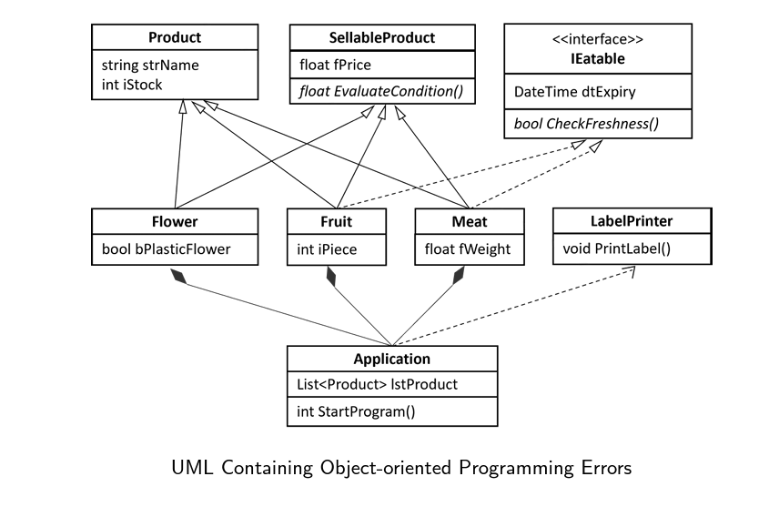
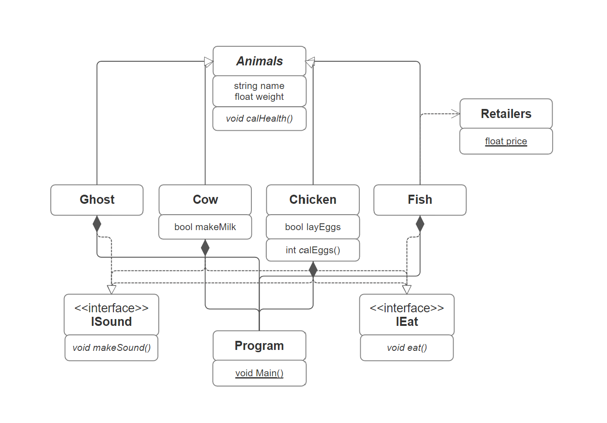
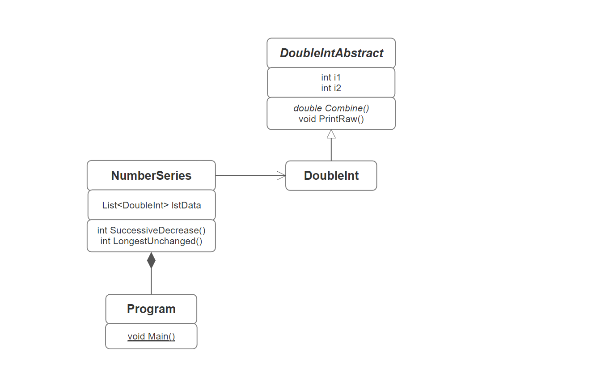

# Appendix for COMP2221 Exam Notes - OOP
### Mega Example
```cs
public abstract class Parent {

    // Variables and Properties //
    // By convention use _[varname]
    private int _intValue; 
    // Properties
    public int intValue 
    {
        set {_intValue = value;}
        get (return _intValue;)
    }

    // Abstraction //
    private string _sValue;
    public abstract sValue {set; get;}
    public abstract bool abdPrint(int intValue);

    // Constructor //
    public Parent(int intValue) 
    {
        // Use this. to refer to the variable in the class
        this.intValue = intValue
    }
}
```

# Some C# Syntax
### General
| Syntax | Remarks |
| ------ | ------- |
| ```Concole.Write()```/```Concole.Writeline()``` | Using ```Write()``` multiple times in C# won't start a new line, unlike ```print()``` in Python |
| ```num.ToString()``` | Convert variables to string |

### Random
| Syntax | Remarks |
| ------ | ------- |
| ```new Random()``` | Construct an object for the random class |
| ```ran.Next(min, max)``` | Random integer between the range [min, max) |

### Math
| Syntax | Remarks |
| ------ | ------- |
| ```Math.Sqrt(value)``` | Square root |
| ```Math.Pow(number, power)``` | Power |


### List
| Syntax | Remarks |
| ------ | ------- |
| ```list.Count``` | Length of list |
| ```list.Add(value)``` | Append at the end |
| ```list.Contains(value)``` | Return a boolean - if the list contains the value |
| ```list.Remove(value)``` | Remove value from list |
| ```list.RemoveAt(index)``` | Remove at index |

# UML Diagram Practices for COMP2221 - OOP 

UML diagram questions made with reference to the 2022PP (newer ones will be added later). This is the provided list of arrows in the exam :


### Lecture Example

Given a program that manages farm animals. Draw an UML diagram to present the following system designs:
* The farm animals include Cow, Chicken, Fish and Ghost.
* All animals should have a name and a weight. They also have a function to calculate its health, but different animals use different values to indicate whether it is healthy or not.
* The Cow has a Boolean value that indicates if it can make milk, while the Chicken has a Boolean value that indicates if it can lay eggs, and a function that calculates how much eggs it can lay. 
* Cow, Chicken, and Ghost can make sound, while Cow,Chicken, and Fish can eat. Theses functions are provided in the ```ISound``` and ```IEat``` interfaces.
* The Fish will also access a static variable ```price``` from a class ```Retailers```

### 2022PP Question 3

### 2023PP Question 4e - modified
Draw an UML diagram to present the following system designs:
* There is an abstract DoubleIntAbstract class that has two integers i1 and i2, an abstract method Combine which returns a double value, and a method PrintRaw that doesn't return anything
* A DoubleInt class that inherits the DoubleIntAbstract class and will implement the abstract method
* A NumberSeries class that has a list of DoubleInt (```List<DoubleInt>```) called lstData, two methods SuccessiveDecrease and LongestUnchanged that both return an integer
* The program has create an object of the NumberSeries class

### 2023PP Question 5
Explain this UML diagram and find errors


##### Arrow meanings
* Application has composition arrows to Flower, Fruit and Meat : Objects of these 3 classes will be destroyed when application is destroyed
* Application has dependency arrow to LabelPrinter : It is using some static methods/variables provided by LabelPrinter
* Flower, Fruit and Meat has inheritance arrow to Product and SellableProduct : They are the children of these parent class
* Flower, Fruit and Meat has implementation arrow to IEatable : They are implementing this interface
##### Errors
* Flower, Fruit and Meat are inheriting two parent class
* IEatable has a class variable
* Sellable product has an abstract function but the name of the class isn't in italic
* Application is using the dependency arrow on LabelPrinter but no method in LabelPrinter is static
# .
# .
# .
### Answers
For reference only - I'm not sure if it is correct
##### Lecture Examples

##### 2023PP Question 4e
