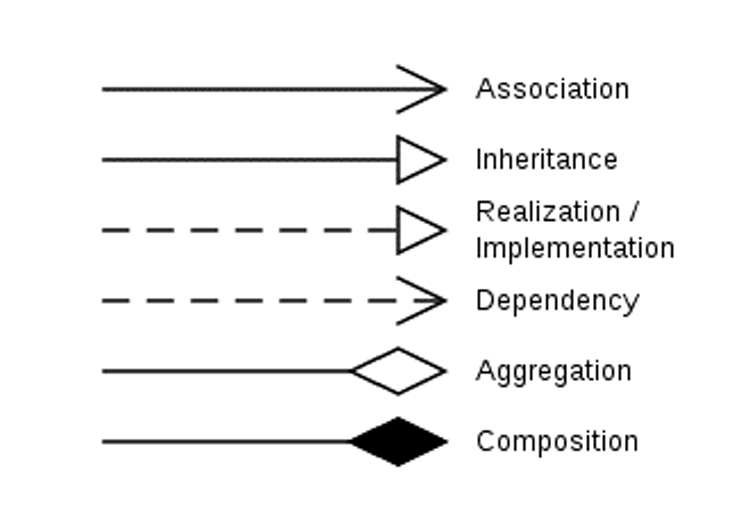

# UML Diagram Practices for COMP2221 - OOP 

UML diagram questions made with reference to the 2022PP (newer ones will be added later). This is the provided list of arrows in the exam :




### Lecture Example

Given a program that manages farm animals. Draw an UML diagram to present the following system designs:
* The farm animals include Cow, Chicken, Fish and Ghost.
* All animals should have a name and a weight.
* The Cow has a Boolean value that indicates if it can make milk, while the Chicken has a Boolean value that indicates if it can lay eggs, and a function that calculates how much eggs it can lay. 
* All animals has a function to calculate its health, but different animals use different values to indicate whether it is healthy or not.
* Cow, Chicken, and Ghost can make sound, while Cow,Chicken, and Fish can eat. Theses functions are provided in the ```ISound``` and ```IEat``` interfaces.
* The Fish will also access a static variable ```price``` from a class ```Retailers```

### 2022PP Question 3

# .
# .
# .
### Answers
##### Lecture Examples
